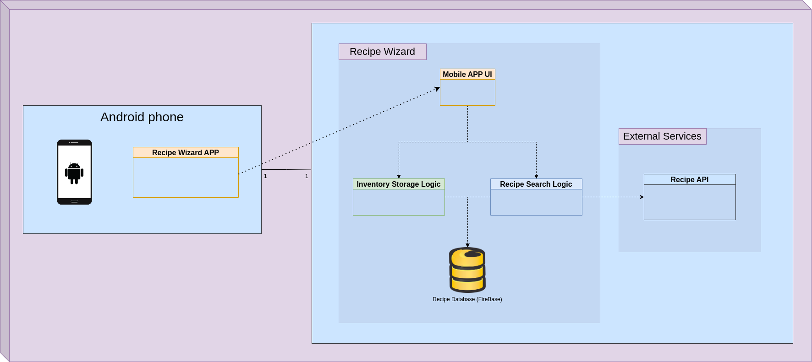

# Physical model of the app

# Logical model of the app

# Structure of the database (not final)
[Database Structure](backup/database_es)

# Mockup of the app
[Figma mockup](https://www.figma.com/proto/DDRXH1P4nR0Y2sQCA3Q3Eq/Figma-Basics?node-id=425%3A148&scaling=scale-down&page-id=0%3A286&starting-point-node-id=447%3A74)