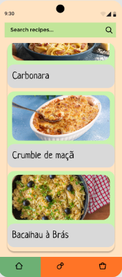

# User Stories

## Feature 1
**Story 1:** As Max I want to be able to input the ingredients I want to use into the app, and get a list of different recipe options that use those ingredients as their main components.

**Acceptance Test:**

Feature:Search Recipes with specific ingredients

   As Max I want to be able to input the ingredients
   I want to use into the app, and get a list of different
   recipe options that use those ingredients as their main components.
   
   Scenario: The user is at the supermaket and wants to see a recipe using a specific meat   
   
   Given: The user navigates to the home page,clicks on the search bar
   
   When: After the login
   
   And:write the ingredients
   
   Then: It appears the recipes using those ingredients

## Feature 2
**Story 1:** As Orlando I want to be able to keep track of the items in my pantry and search various recipes according to what's available. As a result, I can make a nutritious meal for my family without having to go to the grocery store.

**Acceptance Test:**

Feature: Using pantry’s items to make a recipe

  As Orlando I want to be able to keep track of the items
  in my pantry and search various recipes according to what’s available.
  As a result, I can make a nutritious meal for my family without having
  to go to the grocery store.

  Scenario: Search a recipe using the ingredients in the pantry
  
  Given: The user navigates to the pantry page
  
  When: The user adds the ingredients he has in his pantry.
  
  And: Clicks the search button
  
  Then: The app displays all available recipes

## Feature 3 // did not implement because of time constraints
**Story 1:** As Yuumi I want to be able to add my own recipes to the app, so that I can keep all of my favorite recipes in one place. The app should allow me to input the recipe name, ingredients, cooking instructions, and any additional notes or tips.

Feature: Add recipes to the app

  As Yuumi I want to be able to add my own recipes to the app, so that 
  I can keep all of my favorite recipes in one place, also allowing me
  to input the recipe name, ingredients, cooking instructions and any additional notes or tips.
  
  Scenario: Personal recipes to add to the app 
  
  Given: The user navigates to the recipes page 
  
  When: The user clicks the add button
  
  And: Fill in all the recipes inputs
  
  Then: The app adds the recipe to the app

## Feature 4
**Story 1:** As John, when I insert my email, name and password into the register screen form I want to be registered into the app's database and taken to the main page, so I can add ingredients to my inventory and search recipes.

Feature: Login in the app 
  As John, when I insert my email , name and password into the register
  screen form I want to be registered into the app's database and taken
  to the main page, so I can add ingredients to my inventory and search recipes.
  
  Scenario: The user doesn’t have an account 
  
  Given: The user navigates to the login page 
  
  When: The user fills in his email, username and password boxes
  
  And: Clicks the register button 
  
  Then: The user can now login with his new account and the info is added to the app’s database.
  
  
  Scenario:The user has an account
  
  Given: The user navigates to the login page, clicks on Sign in
  
  And: Fill in is information
  
  Then: He enters the account with is personal inventory and recipes

## Feature 5
**Story 1:** When I insert certain ingredients into the pantry, and go to the search screen, I want to be able to filter the recipes by the ingredients I have in my pantry, having the possibility to add a number of missing ingredients to the search.

Feature: Search recipes with missing ingredients

  As John, when I insert certain ingredients into the pantry, and go to the search screen, I want to be able to filter the recipes by the ingredients I have in my pantry, having the possibility to add a number of missing ingredients to the search.
  
  Scenario: The user wants to search a recipe with missing ingredients
  
  Given: The user navigates to the search page

  When: The user selects the filter button

  And: Selects a number of missing ingredients

  Then: The app displays all available recipes with the missing ingredients

## Feature 6
**Story 1:** When I add an ingredient to my inventory/pantry I want the option to see all the available ingredients in a dropdown menu, so I can easily select the ingredients I want to add.

Feature: Select ingredients from the droptdown menu

  As Cain, when I add an ingredient to my inventory/pantry I want the option to see all the available ingredients in a dropdown menu, so I can easily select the ingredients I want to add.
  
  Scenario: The user wants to add an ingredient to his inventory/pantry
  
  Given: The user navigates to the inventory page

  When: The user clicks the add button

  And: Selects the ingredient from the dropdown menu

  Then: The app adds the ingredient to the inventory/pantry

# Acceptance Tests

Given the user has launched the app and has navigated to the inventory feature, when the user adds items to their inventory, then the inventory list should be updated to reflect the new items.

Given the user has launched the app and has navigated to the search page, when the user filters the recipes available by missing ingredients, the list should be updated to reflect the new items.

Given the user has launched the app and has inserted the login details, he should be redirected to the home page.

Given the user has launched the app and is in the home page, when he presses the logout button he should be redirected to the login page.

Given the user has launched the app and is in the home page, when he clicks a recipe he should be redirected to the recipe page.

Given the user is in the register page, when he inputs all the details required to register, he should be redirected to the home page.

Given the user has launched the app and has navigated to the search page, when the user inputs the name of a recipe (total or partial), the list should be updated to reflect the new items.

# Domain Model
A small UML class diagram was made in order to simplify and help in understanding the conxtext of the software system.

