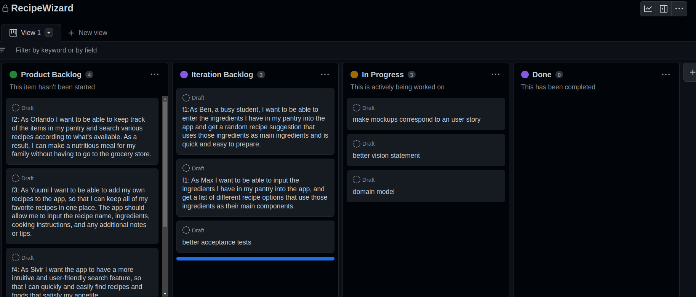

# Sprint 0 Retrospective

## Went well

* Even though there weren't any mock ups for each;

* User story, the overall mockup was good;

* Good github organization; 

* Physical and logical model are good; 

* Vertical prototype done;

* Database structure done;

* Different branches with test features such as firebase support and UI changes; 

* Flutter setup went smoothly.

## Went less well

* Task division; 

* Bad understanding of what we had to do (mockups and acceptance tests for each user story); 

* Didn't submit the domain model; 

* Started working late. 

## Solutions

* Improve communication in order to divide tasks more efficiently;

* Pay more attention to theoretical classes and read documentation;

* Adopt a working schedule.

## Board

