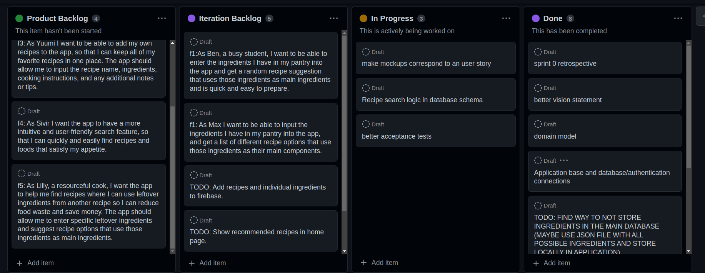

# Sprint 1 Retrospective

## Went well

* Application theme;
* Understanding of firestore;
* Inventory per user well implemented.

## Went less well

* Firebase excessive requests;
* Database schema implementation; 
* Time management.

## Solutions

* Research more about firebase and firestore;
* Schedule which user stories to do.

## Board

