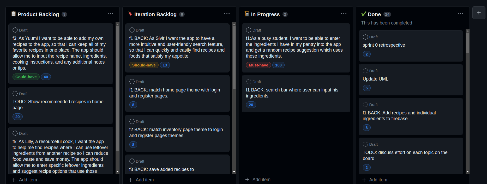

# Sprint 0 Retrospective

## Went well

* Implementation of feature that adds ingredients to inventory;

* Implementation of filer recipes feature;

* Acceptance tests;

* Uml update;

* Added more recipes and ingredients to firebase.

## Went less well

* Gherkin acceptance tests;

## Solutions

* Attend to theoretical classes and start doing tasks earlier.

## Board

