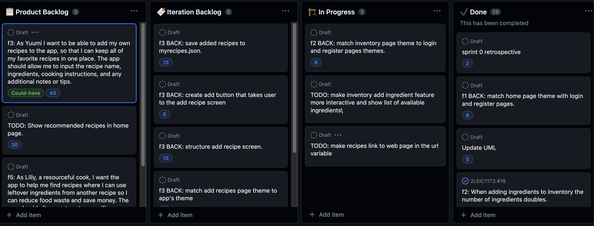

# Sprint 3 Retrospective

## Went well

* Enchanced overall user experience;

* Fixed inventory duplication glitch;

* Implemented search bar for recipe filtering;

* Made the overall app's theme match the user / login pages.

## Went less well

* Time management.

## Solutions

* Better communication.

## Board

